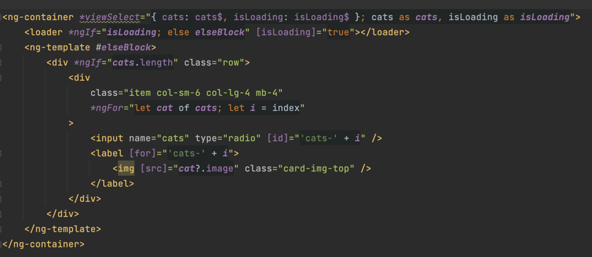

## FE Tasks

**The application is very simple, it only contains two pages:**

* **rate.component.ts** - Showing random GIFs of cats. Once user rates the GIFs, his vote is saved to the API. When
  rating, the user has 3 seconds to change their mind. During this 3 secs we're loading the next image.
* **top-rated.component.ts** - Showing the top-rated 50 GIFs loaded from the API.
* Whole app may also contain bugs, performance issues and inefficient code. If you find something feel free to fix
  it or improve it.

**complete all assigned tasks in single Pull Request**

## 1. Angular tasks
- [ ] **1.1 create rating.component** - This component should allow to rate from 1 to 5. It could be represented by stars
  or whatever you want. Use this component as a form control in the body of <form> in rate.component.html instead of
  currently used form controls.
- [ ] **1.2 create a new structural directive and use it `top-rated.component.html`** - that accepts an object of any
  observables, internally subscribes to them and exposes the values from those observables as variables named by
  original object keys. Directive also updates the view as the values are updated.

  For instance:

  

## 2. Redux tasks

- [ ] **2.1 state mutation** - finish implementations of functions `#addOrUpdateEntity()` and `#setActiveEntity()`
  in [store.utils.ts](../src/app/store.utils.ts) and
  test their functionality in [store.utils.spec.ts](../src/app/store.utils.spec.ts) to ensure everything performs as expected.
- [ ] **2.2 finish redux implementation** - use `#addOrUpdateEntity()` and `#setActiveEntity()` in the asynchronous action
  handlers `#loadRandomCat()` and `#rateCat()`
  in [cats.state.ts](../src/app/cats/+state/cats/cats.state.ts) for updating the state.
  - `#rateCat()` is supposed to update state of the cat in the store
  - `#loadRandomCat()` is supposed to add/update cat state in the store and set this cat as active cat to `<CatStateModel['active']>`
- [ ] **2.3 use redux in the components** use `CatsFacade` instead of `CatsApiService` in [top-rated.component.ts](../src/app/cats/top-rated/top-rated.component.ts) and [rate.component.ts](../src/app/cats/rate/rate.component.ts)

## 3. RxJS tasks

- Watch the [video](https://user-images.githubusercontent.com/5442796/215450928-fd09fae4-8848-4c44-a928-c83c49a13f83.mp4) to see expected behavior.
- Do not use any state properties that are not represented by observable in the tasks below
- [ ] **3.1 cat prefetching** - Right after clicking an emoji the component will start preloading another cat
  immediately. This cat will be displayed later, after the rating is sent to backend. The component will preload only one cat
  and won't start another preload before the already preloaded cat is displayed. You should expect that preloading another cat might take longer than 3s (which is the delay before sending a rating).
- [ ] **3.2 remove timer reset** - When clicking an emoji while the timer is already pending, the loading bar won't be reset. The POST request is always sent after 3 seconds from the initial rating (as shown on the video). In other words, after clicking an emoji, the user has 3s to change their mind, and it will not reset the timer.

